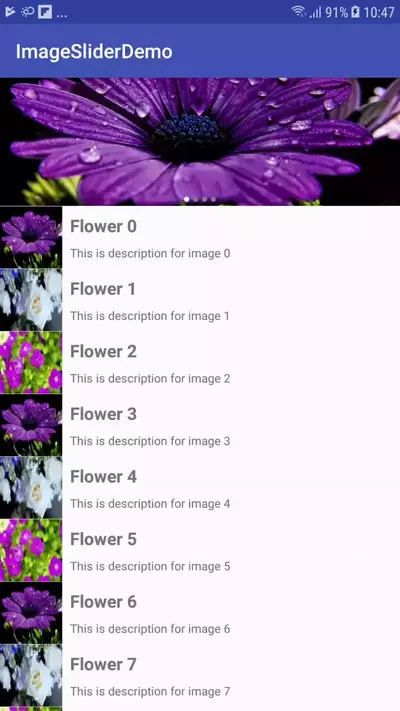

[](https://jitpack.io/#thuannv/PageSliderView)

# PageSliderView
A library which is supported infinite sliding for ViewPager. This PagerSliderView is a general page sliding that you use it for sliding image or other customized sliding pages.



## Getting started
In your root build.gradle file at the end of repositories:
```gradle
allprojects {
    repositories {
        ...
        maven { url 'https://jitpack.io' }
    }
}
```

In your app build.gradle file, add the dependency:
```gradle
dependencies {
    implementation 'com.github.thuannv:PageSliderView:v1.0'
}
```
In your xml layout file
```xml
<!-- Image Slider -->
<thuannv.pageslider.PageSliderView
    android:id="@+id/image_slider"
    android:layout_width="0dp"
    android:layout_height="wrap_content"
    app:autoSlide="true"
    app:autoSlideDuration="4000"
    app:layout_constraintEnd_toEndOf="parent"
    app:layout_constraintStart_toStartOf="parent"
    app:layout_constraintTop_toTopOf="parent"
    />
```
Creating an ViewPager Adapter, such as ImageSliderAdapter
```java
public class ImageSliderAdapter extends PagerAdapter {

    private List<ImageSource> mImages;

    private OnItemClickedListener mItemClickListener;

    public ImageSliderAdapter(List<ImageSource> sources) {
        if (sources == null) {
            mImages = new ArrayList<>();
        } else {
            mImages = new ArrayList<>(sources);
        }
    }

    public void setItemClickListener(OnItemClickedListener itemClickListener) {
        mItemClickListener = itemClickListener;
    }

    @Override
    public int getCount() {
        return mImages.size();
    }

    @Override
    public boolean isViewFromObject(@NonNull View view,@NonNull Object object) {
        return view == object;
    }

    @NonNull
    @Override
    public Object instantiateItem(@NonNull ViewGroup container, int position) {
        final Context context = container.getContext();
        final ImageSource image = mImages.get(position);
        final ImageView imageView = new ImageView(context);
        imageView.setScaleType(ImageView.ScaleType.CENTER_CROP);
        imageView.setOnClickListener(v -> {
            if (mItemClickListener != null) {
                mItemClickListener.onClicked(image);
            }
        });

        bind(context, imageView, image);
        container.addView(imageView, new ViewGroup.LayoutParams(
            ViewGroup.LayoutParams.MATCH_PARENT, 
            ViewGroup.LayoutParams.MATCH_PARENT));
        return imageView;
    }

    @Override
    public void destroyItem(@NonNull ViewGroup container, int position, Object object) {
        container.removeView((View) object);
    }

    private void bind(Context context, ImageView imageView, ImageSource source) {
        final RequestManager glide = Glide.with(context);
        if (source.isPath()) {
            glide.load(source.getPath()).into(imageView);
        } else if (source.isFile()) {
            glide.load(source.getFile()).into(imageView);
        } else if (source.isUri()) {
            glide.load(source.getUri()).into(imageView);
        } else if (source.isLocalResourceId()) {
            glide.load(source.getResourceId()).into(imageView);
        }
    }


    /**
     * {@link OnItemClickedListener}
     */
    public interface OnItemClickedListener {
        void onClicked(ImageSource source);
    }
}
```

In your Activity or any places that you intend to use slider view, write such small pieces of code:
```java
    private void setupImageSlider() {
        mImageSliderAdapter = new ImageSliderAdapter(ImagesProvider.provides());
        mImageSliderAdapter.setItemClickListener((image) -> {
            //TODO: your code goes here.
        });
        mImageSliderView.setAdapter(InfinitePagerAdapter.wrap(mImageSliderAdapter));
    }
```

And, you're DONE!


## License

    Copyright (C) 2018 thuannv

    Licensed under the Apache License, Version 2.0 (the "License");
    you may not use this file except in compliance with the License.
    You may obtain a copy of the License at

       http://www.apache.org/licenses/LICENSE-2.0

    Unless required by applicable law or agreed to in writing, software
    distributed under the License is distributed on an "AS IS" BASIS,
    WITHOUT WARRANTIES OR CONDITIONS OF ANY KIND, either express or implied.
    See the License for the specific language governing permissions and
    limitations under the License.